# CSCE 435 Group project

## 0. Group number:

25

## 1. Group members:

1. Jack Couture
2. Deric Le
3. Jose Ortiz
4. Sam Zhang
5. Dennis Dang

We will communicate using Slack and everyone will be responsible for their algorithm and its requirements.

## 2. Project topic

Parallel Sorting Algorithms

### 2a. Brief project description (what algorithms will you be comparing and on what architectures)

For this project, we will be comparing the sorting algorithms listed below:

- Bitonic Sort (Dennis Dang): Bitonic sort is a sorting algorithm that first creates a bitonic sequence and then performs a bitonic merge to create a sorted sequence. In order to make a parallel program for bitonic sort, the array data will be split among $p$ processors. Each processor will then sort their data either ascending or descending based on rank number and then use MPI to create the bitonic sequence. Then, MPI will be used again to allow the processors to communicate and exchange data between one another to perform the bitonic merge.

- Samplesort (Sam Zhang): samplesort is a generalization of quick sort used in parallel processing systems. Samplesort partitions an unsorted list into $k$ buckets, and sorts each bucket. In parallel computing, $p$ buckets are assigned to $p$ processors, allowing efficient sorting of buckets.

- Merge Sort (Jack Couture): Merge sort is a sorting algorithm that divides up the data to work more efficiently and can be used to rapidly sort with parallel computing much larger sets of data. It will take the data and divide them among $p$ processors which will run in parallel to sort the divided segments. This allows the large number of buckets and data to be much more rapidly sorted.

- Radix Sort (Deric Le): A sorting algorithm that compares the digits/characters of each element instead of the entire element. Since each sorting step is independent of eachother, it can be parallelized efficiently. For each element, we can create a groups based on the index of each digit/character. For example, given a list [23,1,789], we will have three groups: [3,1,9], [2,None,8], [None,None,7], where each group corresponds to the digits at the same index across the elements. Next, we can sort each group independently, and then reconstruct them to output the sorted list.

- Column Sort (Jose Ortiz): Columnsort is a parallel sorting algorithm that arranges the input into an $r$ x $s$ matrix, where each processor manages a subset of columns. The algorithm operates through multiple rounds of sorting and permutations. First, the columns are independently sorted. Then, a fixed permutation is applied to redistribute elements across the columns. This process of column sorting and inter-column permutations repeats until the rows of the matrix are fully sorted. The first column will hold the smallest elements, sorted from top to bottom, followed by the next columns in order. To achieve parallel Columnsort using MPI, the matrix is distributed across multiple processors, with each processor responsible for managing and sorting a subset of the columns. MPI enables efficient communication between processors during the sorting and permutation phases.

We will use MPI for message passing and code in C++.

### 2b. Pseudocode for each parallel algorithm

- For MPI programs, include MPI calls you will use to coordinate between processes

  - Bitonic Sort (Dennis Dang):

    ```
    Initialize MPI

    If rank == MASTER:
      Generate data and split the data among the number of processors using MPI_Scatter

    if rank % 2 == 0
      Locally sort data into ascending order using any standard sorting algorithm
    else: // rank % 2 != 0
      Locally sort data into descending order using any standard sorting algorithm

    Create bitonic sequence using MPI_Send and MPI_Recv
    Perform bitonic merging between processors using MPI_Send and MPI_Recv
    Gather sorted data to the Master process using MPI_Gather

    Finalize MPI
    ```

  - Samplesort (Sam Zhang):

    ```
    # Assumptions:
    # - Each processor has an unsorted sub-list.
    # - Goal is to ensure the i-th processor has a sorted sub-list satisfying,
    #   the maximum element held the by i-th processor is smaller than the
    #   minimum element held by the (i + 1)-th processor.

    # Definitions:
    # - pid: processor id (Comm_rank).
    # - num_processors: total number of processors (Comm_size).
    # - L: the unsorted sub-list held on this processor.
    # - DType: data type of elements in L.
    # - k: number of samples to pick from L.
    # - sample(L,k): samples k random elements from L.
    # - sort(L): sequential quick sort, returns a sorted list.

    def sample_sort(pid: UINT, num_processors: UINT, L: LIST, DType: TYPE, k: UINT):
      # take k samples from the list I have and gather samples from others
      frag_p <- sample(L, k)
      samples <- All_Gather(frag_p, k, DType, k * num_processors)
      # sort gathered samples and choose pivots
      sorted_samples <- sort(samples)
      pivots <- []
      for i in {1, 2, ..., len(sorted_samples) - 1}:
        if ((i % floor(len(sorted_samples) / num_processors)) == 0):
          pivots.append(sorted_samples[i])
      # initialize buckets
      buckets <-[]
      for i in {1,2,...,num_processors}:
        buckets.append([])
      # put elements I have into buckets
      for element in L:
        for i in {1,2,...,num_processors}:
          if (element <= pivots[i]):
            buckets[i].append(element)
            break
      # sort each bucket
      for i in {1,2,...,num_processors}:
        buckets[i] <- sort(buckets[i])
      # exchange buckets
      for i in {1,2,...,num_processors}:
        if (pid == i):
          # receive buckets corresponding to my pid from every processor
          for j in {1,2,...,num_processors}:
            if (j != pid):
              recv_bucket_size <- recv(1, ULONG, j)
              recv_bucket <- recv(recv_bucket_size, DType, j)
              recv_vals.append(flatten(recv_bucket))
            else:
              recv_vals.append(flatten(buckets[pid]))
        else:
          # send i-th bucket to the i-th processor
          send(len(bucket[i]), 1, ULONG, i)
          send(buckets[i], len(buckets[i]), DType, i)
      # sort received values
      sorted_recv_vals = sort(recv_vals)
    ```

  - Merge Sort (Jack Couture):

    ```
    //Initialize MPI
    MPI_Init(&argc, &argv);
    MPI_Comm_size(MPI_COMM_WORLD, &num_processes); // Get number of processors
    MPI_Comm_rank(MPI_COMM_WORLD, &rank); // Get rank of the current process

    //Distribute input data
    if (rank == 0)
    {
      input_data = ReadInputData();
      total_elements = size_of(input_data); // total number of elements to sort
      elements_per_process = total_elements / num_processes;

    //Distribute segments of input data to each process
      for (i = 1; i < num_processes; i++)
      {
          start_index = i * elements_per_process;
          MPI_Send(&input_data[start_index], elements_per_process, MPI_INT, i, 0, MPI_COMM_WORLD);
      }

    //Master keeps the first portion of the data
      local_data = input_data[0:elements_per_process];
    }
    else
    {
    //Other processes receive their segments of the array
      MPI_Recv(&local_data, elements_per_process, MPI_INT, 0, 0, MPI_COMM_WORLD, MPI_STATUS_IGNORE);
    }

    //Each process sorts its local segment
    local_sorted_data = sort(local_data);

    //Gather sorted segments at the master process
    if (rank == 0)
    {
      sorted_data = InitializeArray(total_elements);
      copy(local_sorted_data, sorted_data[0:elements_per_process]);

    // Receive sorted segments from other processes
      for (i = 1; i < num_processes; i++)
      {
          start_index = i * elements_per_process;
          MPI_Recv(&sorted_data[start_index], elements_per_process, MPI_INT, i, 1, MPI_COMM_WORLD, MPI_STATUS_IGNORE);
      }

    //Merge all sorted segments at the master process
      final_sorted_data = MergeSortedSegments(sorted_data, num_processes, elements_per_process);

    }
    else
    {
    // Other processes send their sorted segment to the master process
      MPI_Send(local_sorted_data, elements_per_process, MPI_INT, 0, 1, MPI_COMM_WORLD);
    }

    // Finalize MPI
    MPI_Finalize();
    ```

  - Radix Sort (Deric Le):

    ```
    MPI_Init()

    MPI_Comm_size()
    MPI_Comm_rank()

    // master process distributes data to all processes
    if rank == 0:
        elements = [23, 1, 789, ...]

        biggest_element = get_max(elements)

        // distribute the elements to each worker evenly
        for process in processes:
            MPI_Send(elements, worker)

    // worker process receive, calculate, send
    else:
        // worker processes receive the elements
        MPI_Recv(received_elements)

        // worker processes sort the groups
        for digit_index in range(max_digits):
            current_digits = extract_group(received_elements, digit_index)
            sorted_group = sort(current_digits)

            MPI_Send(sorted_group, master)

    // master process receives sorted groups
    if rank == 0:
        // receive the sorted groups from workers
        MPI_Recv(sorted_group, worker)

        result = combine_sorted_groups(sorted_group)
        print(result)

    MPI_Finalize()
    ```

  - Column Sort (Jose Ortiz):

    ```
    // initialize MPI
    MPI_Init(&argc, &argv);
    MPI_Comm_size(MPI_COMM_WORLD, &num_procs);
    MPI_Comm_rank(MPI_COMM_WORLD, &rank);

    // define matrix dimensions
    int r = ...;  // number of rows
    int s = ...;  // number of columns
    int local_columns = s / num_procs;  // num of columns per processor
    int local_matrix[r][local_columns];  // column handled by each processor

    // distribute data across processors
    if (rank == 0) {
        // send each processor its subset of columns
        for (int p = 1; p < num_procs; p++) {
            MPI_Send(&matrix[r][p * local_columns], r * local_columns, MPI_INT, p, 0, MPI_COMM_WORLD);
        }
    } else {
        // recieve matrix part on non-master processors
        MPI_Recv(&local_matrix, r * local_columns, MPI_INT, 0, 0, MPI_COMM_WORLD, MPI_STATUS_IGNORE);
    }

    for (int iter = 0; iter < num_iterations; iter++) {
        // sort columns locally
        for (int col = 0; col < local_columns; col++) {
            sort_column(local_matrix, r, col);
        }

        // perform fixed permutation
        if (rank == 0) {
            for (int p = 1; p < num_procs; p++) {
                // gather sorted array from each column
                MPI_Recv(&local_matrix, r * local_columns, MPI_INT, p, 0, MPI_COMM_WORLD, MPI_STATUS_IGNORE);
            }

            // logic for matrix permutation
            permute_matrix(local_matrix, r, s);

            // redistritube permuted matrix back to processors
            for (int p = 1; p < num_procs; p++) {
                MPI_Send(&matrix[r][p * local_columns], r * local_columns, MPI_INT, p, 0, MPI_COMM_WORLD);
            }
        } else {
            // sorted column back to rank 0 for perm
            MPI_Send(&local_matrix, r * local_columns, MPI_INT, 0, 0, MPI_COMM_WORLD);

            // permuted matrix back from 0
            MPI_Recv(&local_matrix, r * local_columns, MPI_INT, 0, 0, MPI_COMM_WORLD, MPI_STATUS_IGNORE);
        }

        // repeat untill matrix is fully sorted
    }

    // gather final sorted data from all processors
    if (rank == 0) {
        for (int p = 1; p < num_procs; p++) {
            MPI_Recv(&matrix[r][p * local_columns], r * local_columns, MPI_INT, p, 0, MPI_COMM_WORLD, MPI_STATUS_IGNORE);
        }
    } else {
        MPI_Send(&local_matrix, r * local_columns, MPI_INT, 0, 0, MPI_COMM_WORLD);
    }

    // finalize MPI
    MPI_Finalize();
    ```

### 2c. Evaluation plan - what and how will you measure and compare

- Input sizes, Input types
  - For our inputs, we will be using arrays of integers of size 2<sup>16</sup>, 2<sup>18</sup>, 2<sup>20</sup>, 2<sup>22</sup>, 2<sup>24</sup>, 2<sup>26</sup>, and 2<sup>28</sup>
  - Our input types will include arrays containing random data, sorted data, reverse sorted data, and 1% perturbed
- MPI number of processes:
  - 2, 4, 8, 16, 32, 64, 128, 256, 512, 1024
- Strong scaling (same problem size, increase number of processors/nodes)
- Weak scaling (increase problem size, increase number of processors)

### 3a. Caliper instrumentation

Please use the caliper build `/scratch/group/csce435-f24/Caliper/caliper/share/cmake/caliper`
(same as lab2 build.sh) to collect caliper files for each experiment you run.

Your Caliper annotations should result in the following calltree
(use `Thicket.tree()` to see the calltree):

```
main
|_ data_init_X      # X = runtime OR io
|_ comm
|    |_ comm_small
|    |_ comm_large
|_ comp
|    |_ comp_small
|    |_ comp_large
|_ correctness_check
```

Required region annotations:

- `main` - top-level main function.
  - `data_init_X` - the function where input data is generated or read in from file. Use _data_init_runtime_ if you are generating the data during the program, and _data_init_io_ if you are reading the data from a file.
  - `correctness_check` - function for checking the correctness of the algorithm output (e.g., checking if the resulting data is sorted).
  - `comm` - All communication-related functions in your algorithm should be nested under the `comm` region.
    - Inside the `comm` region, you should create regions to indicate how much data you are communicating (i.e., `comm_small` if you are sending or broadcasting a few values, `comm_large` if you are sending all of your local values).
    - Notice that auxillary functions like MPI_init are not under here.
  - `comp` - All computation functions within your algorithm should be nested under the `comp` region.
    - Inside the `comp` region, you should create regions to indicate how much data you are computing on (i.e., `comp_small` if you are sorting a few values like the splitters, `comp_large` if you are sorting values in the array).
    - Notice that auxillary functions like data_init are not under here.
  - `MPI_X` - You will also see MPI regions in the calltree if using the appropriate MPI profiling configuration (see **Builds/**). Examples shown below.

All functions will be called from `main` and most will be grouped under either `comm` or `comp` regions, representing communication and computation, respectively. You should be timing as many significant functions in your code as possible. **Do not** time print statements or other insignificant operations that may skew the performance measurements.

### **Nesting Code Regions Example** - all computation code regions should be nested in the "comp" parent code region as following:

```
CALI_MARK_BEGIN("comp");
CALI_MARK_BEGIN("comp_small");
sort_pivots(pivot_arr);
CALI_MARK_END("comp_small");
CALI_MARK_END("comp");

# Other non-computation code
...

CALI_MARK_BEGIN("comp");
CALI_MARK_BEGIN("comp_large");
sort_values(arr);
CALI_MARK_END("comp_large");
CALI_MARK_END("comp");
```

### **Calltrees**:

```
# Bitonic Sort
0.666 main
├─ 0.000 MPI_Init
├─ 0.088 main
│  ├─ 0.003 data_init_runtime
│  ├─ 0.012 comp
│  │  ├─ 0.010 comp_small
│  │  └─ 0.003 comp_large
│  ├─ 0.057 comm
│  │  ├─ 0.023 comm_small
│  │  │  └─ 0.023 MPI_Sendrecv
│  │  └─ 0.034 MPI_Barrier
│  └─ 0.014 correctness_check
│     ├─ 0.000 MPI_Recv
│     ├─ 0.000 MPI_Send
│     ├─ 0.013 MPI_Reduce
│     └─ 0.000 MPI_Bcast
├─ 0.000 MPI_Finalize
├─ 0.000 MPI_Initialized
├─ 0.000 MPI_Finalized
└─ 0.020 MPI_Comm_dup
```

```
# Samplesort
1.614 main
├─ 0.003 MPI_Comm_dup
├─ 0.000 MPI_Finalize
├─ 0.000 MPI_Finalized
├─ 0.000 MPI_Init
├─ 0.000 MPI_Initialized
├─ 0.002 correctness_check
│  ├─ 0.000 MPI_Bcast
│  ├─ 0.000 MPI_Recv
│  ├─ 0.000 MPI_Reduce
│  └─ 0.000 MPI_Send
├─ 0.002 data_init_runtime
└─ 0.087 sort_runtime
   ├─ 0.000 MPI_Barrier
   ├─ 0.061 comm
   │  ├─ 0.043 comm_large
   │  │  ├─ 0.002 MPI_Gather
   │  │  └─ 0.040 MPI_Gatherv
   │  └─ 0.019 comm_small
   │     ├─ 0.017 MPI_Bcast
   │     └─ 0.002 MPI_Gather
   └─ 0.026 comp
      ├─ 0.025 comp_large
      └─ 0.000 comp_small
```

```
# Merge Sort
0.624 main
├─ 0.000 MPI_Init
├─ 0.079 main
│  ├─ 0.003 data_init_runtime
│  ├─ 0.006 comp
│  │  ├─ 0.005 comp_small
│  │  └─ 0.002 comp_large
│  ├─ 0.049 comm
│  │  ├─ 0.049 comm_small
│  │  │  ├─ 0.008 MPI_Recv
│  │  │  ├─ 0.000 MPI_Send
│  │  │  ├─ 0.045 MPI_Barrier
│  │  │  └─ 0.000 MPI_Bcast
│  │  └─ 0.000 comm_large
│  │     ├─ 0.000 MPI_Recv
│  │     ├─ 0.000 MPI_Send
│  │     └─ 0.000 MPI_Scatterv
│  └─ 0.020 correctness_check
│     ├─ 0.003 MPI_Recv
│     ├─ 0.000 MPI_Send
│     ├─ 0.017 MPI_Reduce
│     └─ 0.000 MPI_Bcast
├─ 0.000 MPI_Finalize
├─ 0.000 MPI_Initialized
├─ 0.000 MPI_Finalized
└─ 0.020 MPI_Comm_dup
```

```
# Radix Sort
2.623 main
├─ 0.003 MPI_Comm_dup
├─ 0.000 MPI_Finalize
├─ 0.000 MPI_Finalized
├─ 0.000 MPI_Initialized
└─ 2.620 main
   ├─ 0.255 MPI_Barrier
   ├─ 0.000 MPI_Init
   ├─ 0.434 comm
   │  ├─ 0.426 comm_large
   │  │  ├─ 0.017 MPI_Isend
   │  │  └─ 0.384 MPI_Recv
   │  └─ 0.008 comm_small
   │     ├─ 0.001 MPI_Isend
   │     └─ 0.006 MPI_Recv
   ├─ 0.169 comp
   │  ├─ 0.164 comp_large
   │  └─ 0.005 comp_small
   ├─ 0.000 correctness_check
   └─ 0.023 data_init_runtime
```

```
# Column Sort
0.386 main
├─ 0.000 MPI_Init
├─ 0.014 main
│  ├─ 0.001 data_init_runtime
│  └─ 0.013 correctness_check
│     ├─ 0.000 MPI_Recv
│     ├─ 0.000 MPI_Send
│     ├─ 0.012 MPI_Reduce
│     └─ 0.000 MPI_Bcast
├─ 0.000 MPI_Finalize
├─ 0.000 MPI_Initialized
├─ 0.000 MPI_Finalized
└─ 0.001 MPI_Comm_dup
```

### 3b. Collect Metadata

Have the following code in your programs to collect metadata:

```
adiak::init(NULL);
adiak::launchdate();    // launch date of the job
adiak::libraries();     // Libraries used
adiak::cmdline();       // Command line used to launch the job
adiak::clustername();   // Name of the cluster
adiak::value("algorithm", algorithm); // The name of the algorithm you are using (e.g., "merge", "bitonic")
adiak::value("programming_model", programming_model); // e.g. "mpi"
adiak::value("data_type", data_type); // The datatype of input elements (e.g., double, int, float)
adiak::value("size_of_data_type", size_of_data_type); // sizeof(datatype) of input elements in bytes (e.g., 1, 2, 4)
adiak::value("input_size", input_size); // The number of elements in input dataset (1000)
adiak::value("input_type", input_type); // For sorting, this would be choices: ("Sorted", "ReverseSorted", "Random", "1_perc_perturbed")
adiak::value("num_procs", num_procs); // The number of processors (MPI ranks)
adiak::value("scalability", scalability); // The scalability of your algorithm. choices: ("strong", "weak")
adiak::value("group_num", group_number); // The number of your group (integer, e.g., 1, 10)
adiak::value("implementation_source", implementation_source); // Where you got the source code of your algorithm. choices: ("online", "ai", "handwritten").
```

They will show up in the `Thicket.metadata` if the caliper file is read into Thicket.

### **See the `Builds/` directory to find the correct Caliper configurations to get the performance metrics.** They will show up in the `Thicket.dataframe` when the Caliper file is read into Thicket.

## 4. Performance evaluation

Include detailed analysis of computation performance, communication performance.
Include figures and explanation of your analysis.

### 4a. Vary the following parameters

For input_size's:

- 2^16, 2^18, 2^20, 2^22, 2^24, 2^26, 2^28

For input_type's:

- Sorted, Random, Reverse sorted, 1%perturbed

MPI: num_procs:

- 2, 4, 8, 16, 32, 64, 128, 256, 512, 1024

This should result in 4x7x10=280 Caliper files for your MPI experiments.

<ins>Note:</ins> Due to issues with Grace, we did not do runs for 1024 processes, resulting in 4x7x9=252 Caliper files for our MPI experiments.

### 4b. Hints for performance analysis

To automate running a set of experiments, parameterize your program.

- input_type: "Sorted" could generate a sorted input to pass into your algorithms
- algorithm: You can have a switch statement that calls the different algorithms and sets the Adiak variables accordingly
- num_procs: How many MPI ranks you are using

When your program works with these parameters, you can write a shell script
that will run a for loop over the parameters above (e.g., on 64 processors,
perform runs that invoke algorithm2 for Sorted, ReverseSorted, and Random data).

### 4c. You should measure the following performance metrics

- `Time`
  - Min time/rank
  - Max time/rank
  - Avg time/rank
  - Total time
  - Variance time/rank

- ### <ins>Note:</ins> Due to issues with Grace, plot points for 1024 processors will not be shown.

- ### Bitonic Sort (Dennis Dang)
  - #### Strong Scaling:
    For all input types, the average time for the comp region decreased as more processors were used. This is expected as using more processors means that the data will be split into smaller chunks between processors, making the overall local sorting much quicker. Furthermore, this decrease was more prevalent in larger input sizes due to the fact that sorting smaller input sizes is already a fast computation. With the comm region, the average time remained fairly stable with a slight increase as more processors were used. This is also expected as adding more processors means more overhead when it comes to communicating between processors. As for the main region, for every input type, the average time actually increased as more processors were used for input sizes 2<sup>16</sup>, 2<sup>18</sup>, and 2<sup>20</sup>. We suspect that this is because adding more processors for smaller input sizes just increases the overhead for communicating between processors with little benefit towards the already fast computation time. This interaction can also kind of be seen with input sizes 2<sup>22</sup> and 2<sup>24</sup>, where the average time decreased as the number of processors increased, up to 16 processors, at which point, the time started to increase. With the larger input sizes of 2<sup>26</sup> and 2<sup>28</sup>, the average time constantly decreased with no increase at any point, most likely because the benefit from having more processors outweighed the increased overhead.
    - ##### Avg time/rank:
        
        
        
        
        
        
        
  - #### Strong Scaling Speedup
    The strong scaling speedup graphs further reinforce what was already discussed with the strong scaling graphs. For the main region, we can see that larger input sizes like 2<sup>26</sup> and 2<sup>28</sup> had relatively significant speedup, medium-sized inputs like 2<sup>22</sup> and 2<sup>24</sup> had a slight speedup and then started to decline, and small input sizes like 2<sup>16</sup>, 2<sup>18</sup>, and 2<sup>20</sup> did not have any speedup and just got slower with more processors. For the comp region, we can see a strong increase in speedup for all input sizes with larger input sizes experiencing greater speedup, which as stated before, is expected as the amount of sorting each processor does locally is lessened with added processors. Lastly, for the comm region, the graphs for reverse, sorted, and random input seem a little sporadic, but the general trend is that as more processors are added, the communication time increases, likely due to the increased communication overhead. However, for perturbed inputs, the speedup for the comm region actually increases. We suspect that this could be due to the fact that the runtime for perturbed inputs in general is very slow in comparison to the other input types, resulting in the benefit of having multiple processors being greater than the overhead that they bring.
    - ##### Main Region:
      
    - ##### Comp Region:
      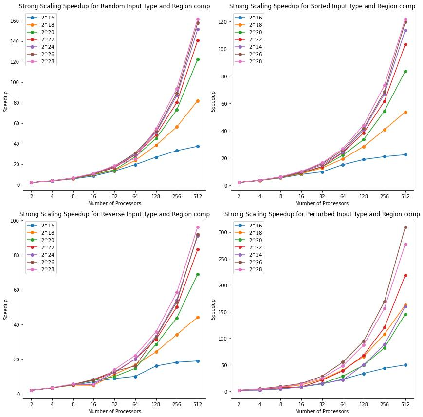
    - ##### Comm Region:
      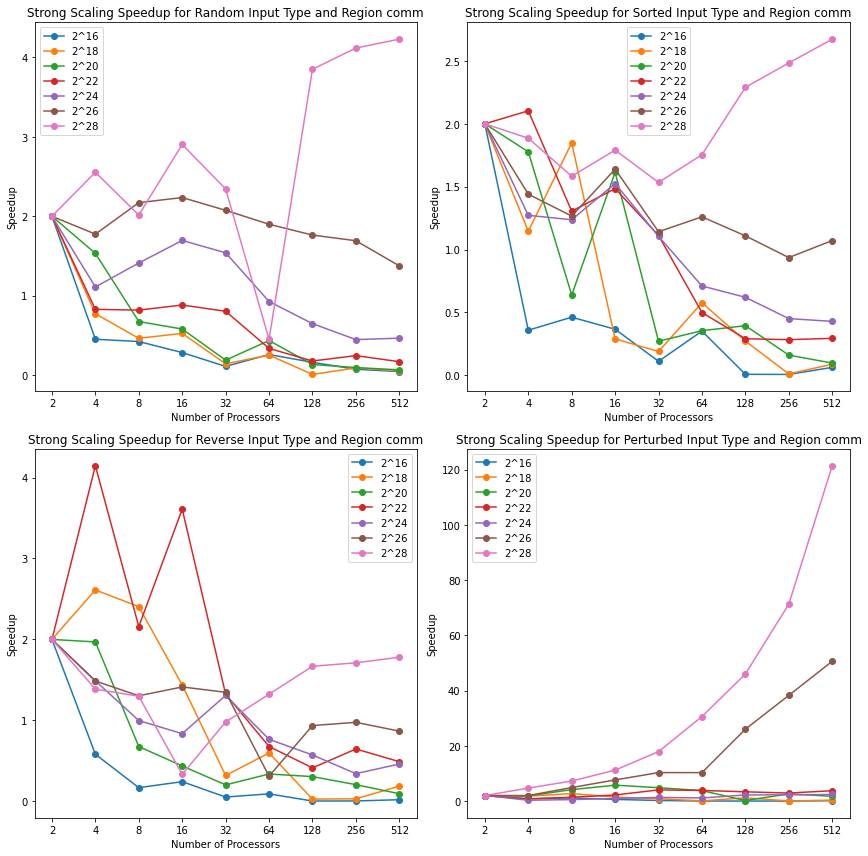
  - #### Weak Scaling
    From the weak scaling graphs, we can see that our implementation for bitonic sort is scalable and able to handle larger problem sizes without significant degradation in performance. For the main region, although the line is not perfectly flat and has an increase, looking at the y-axis, we can see that the increase is only about 1.5 seconds, which is not what we would consider as a significant increase. This slight increase is most likely due to the increased communication overhead from using more processors. We can kind of see that effect with the weak scaling graphs for the comm region, which shows that as the problem size got bigger and more processors were used, the average execution time slightly increased.
    - ##### Main Region:
      
    - ##### Comp Region:
      
    - ##### Comm Region:
      

- ### Samplesort (Sam Zhang)
  - #### Strong Scaling (Avg time/rank):
    The strong scaling analysis for samplesort suggests the runtime does not necessarily decreases as the number of processors increases. Even more interestingly, we observe using more processors can lead to slower runtime when the input size is small. This observation is caused by the communication overhead introduced with using more processors, and the plots produced using the "comm" region best illustrate this overhead. Although using more processors on smaller inputs can lead to longer runtime, using more processors on larger inputs does lead to shorter runtime, which is expected because using more processors lead to greater amount of shorter buckets, which means sorting them require less time. Another interesting note is that we observe the perturbed input require longer sorting time than other input types, and this is because of bad sample selections. Our samplesort algorithm always select the first, the last, and evenly spaced samples from local sequences, but our data generation algorithm always have the first element of the local sequence randomized when perturbed flag is selected. This means we can guarantee at least one bad sample from each local sequence, which can lead to worst-case splitter selection, causing buckets to have uneven sizes.
    - ##### Input Size 2^16:
      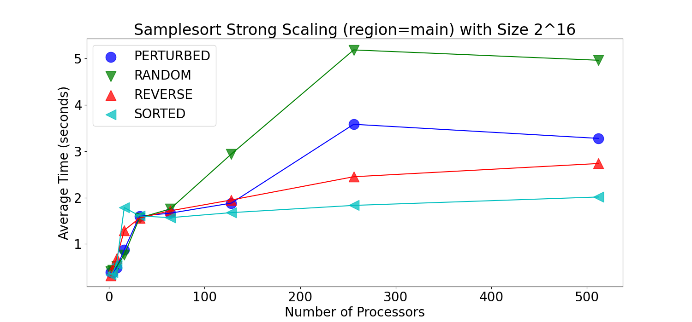
      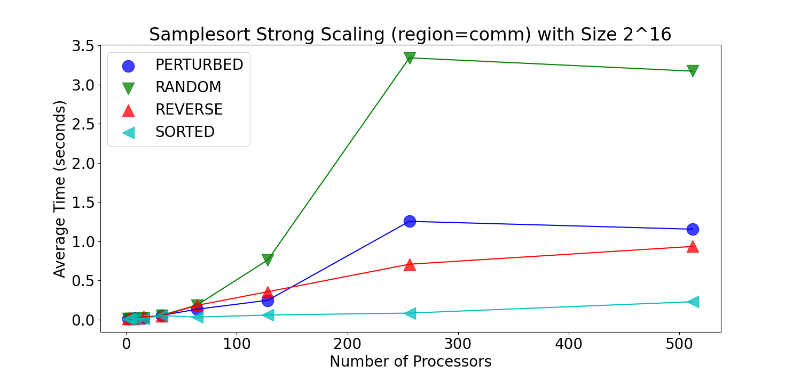
      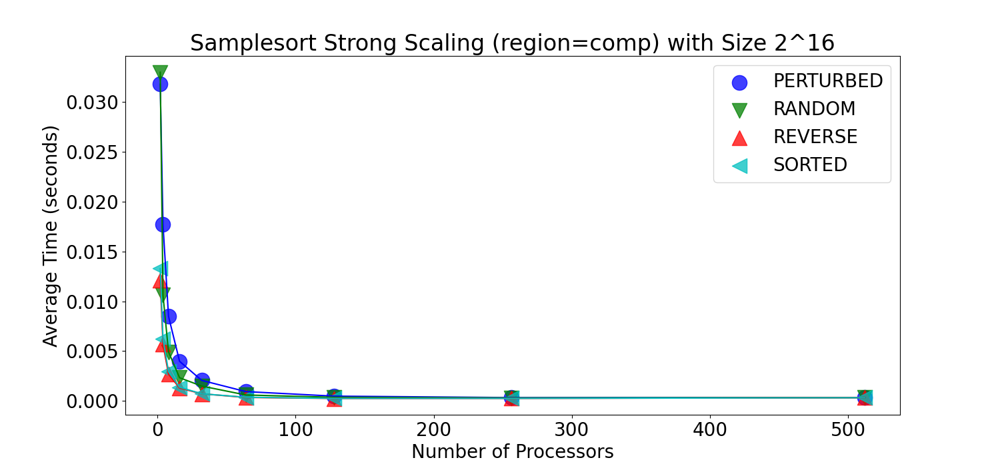
    - ##### Input Size 2^18:
      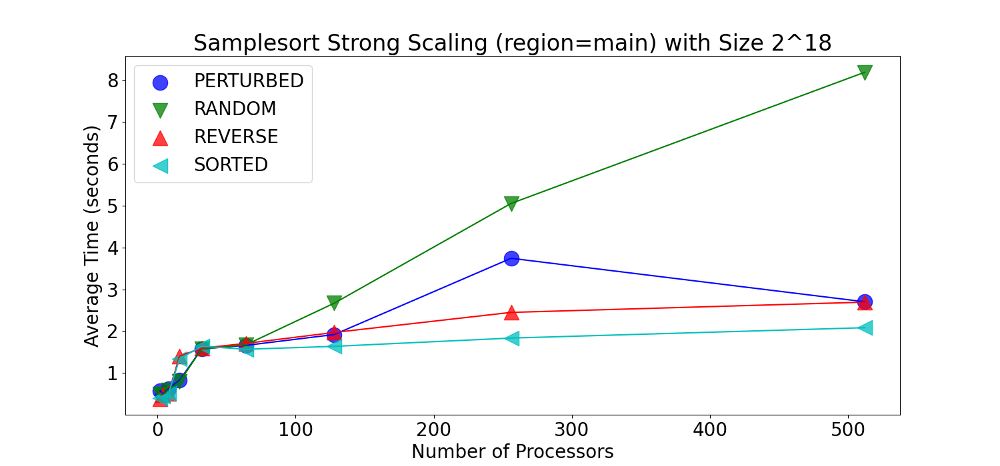
      
      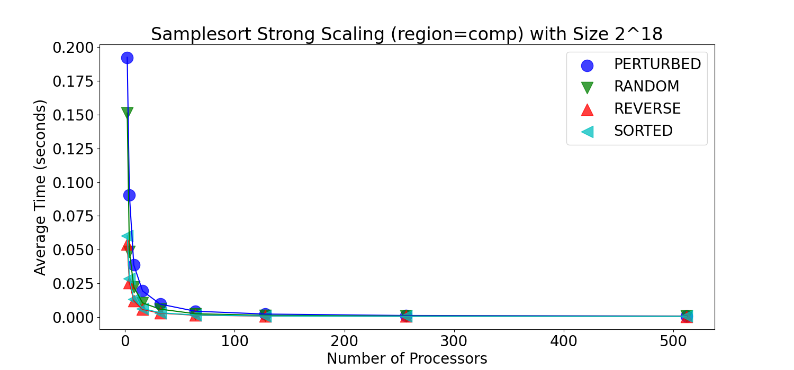
    - ##### Input Size 2^20:
      
      
      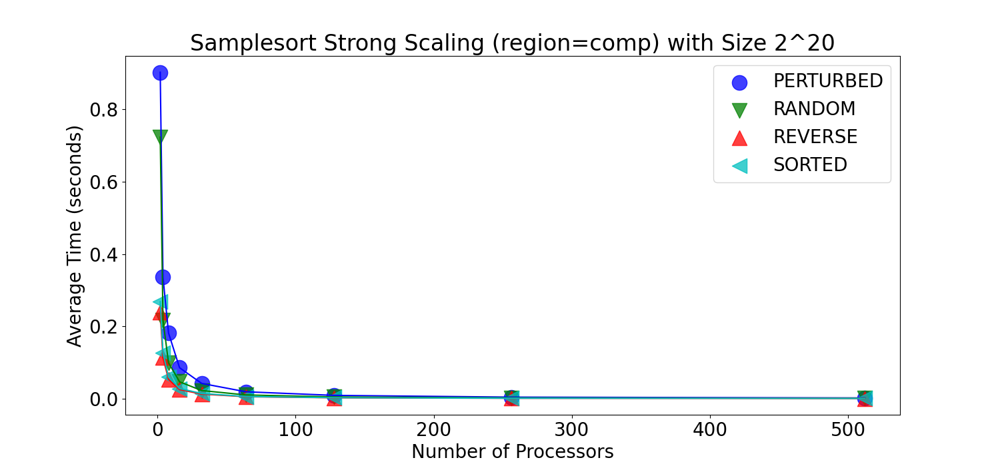
    - ##### Input Size 2^22:
      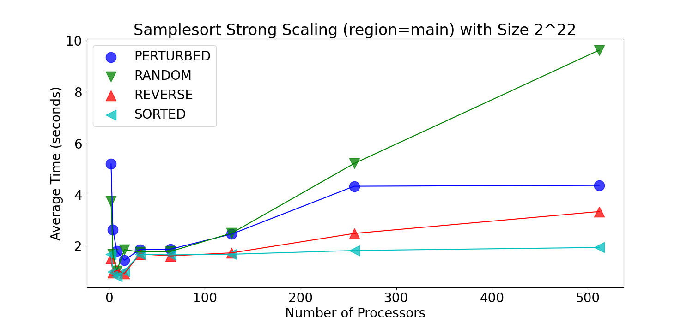
      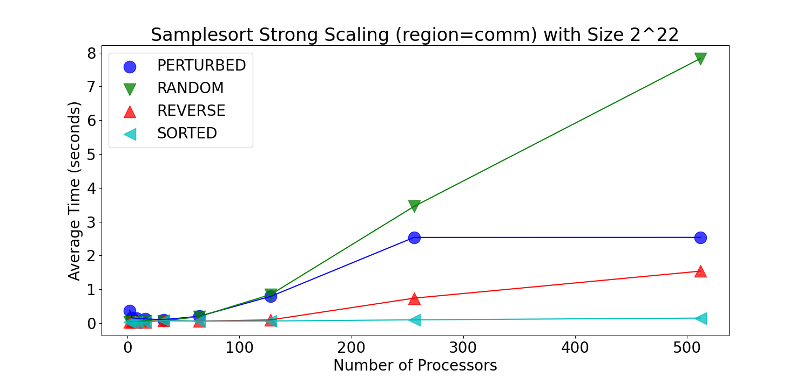
      
    - ##### Input Size 2^24:
      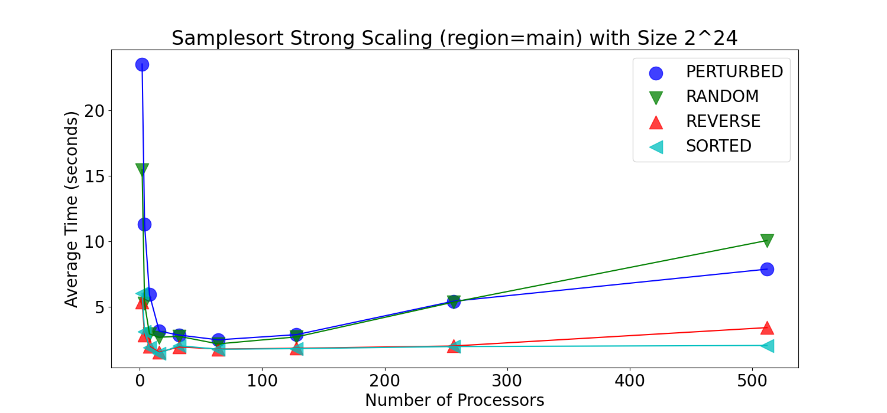
      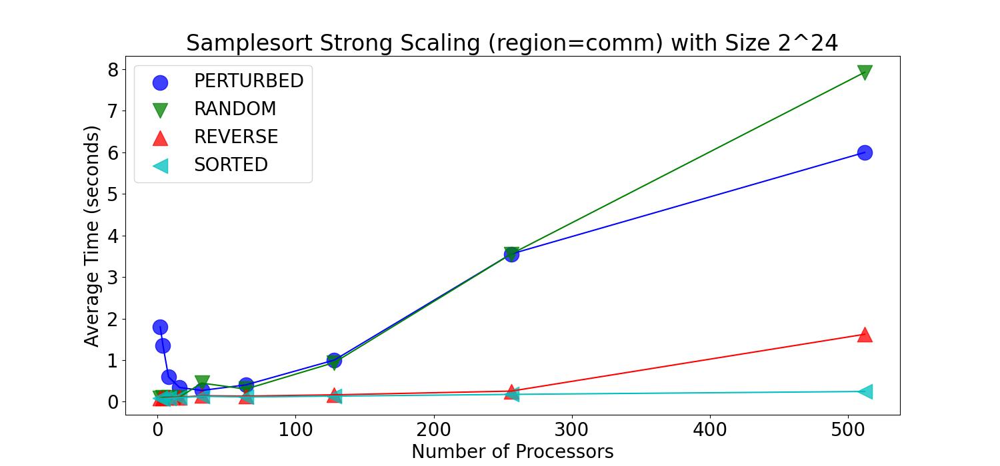
      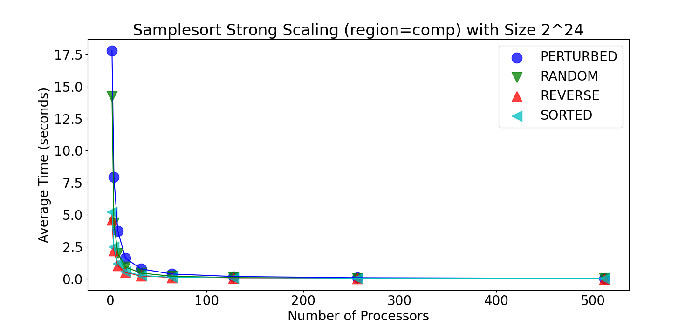
    - ##### Input Size 2^26:
      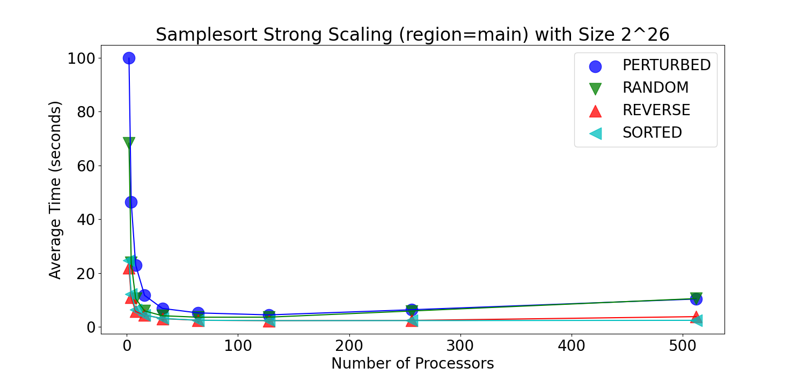
      
      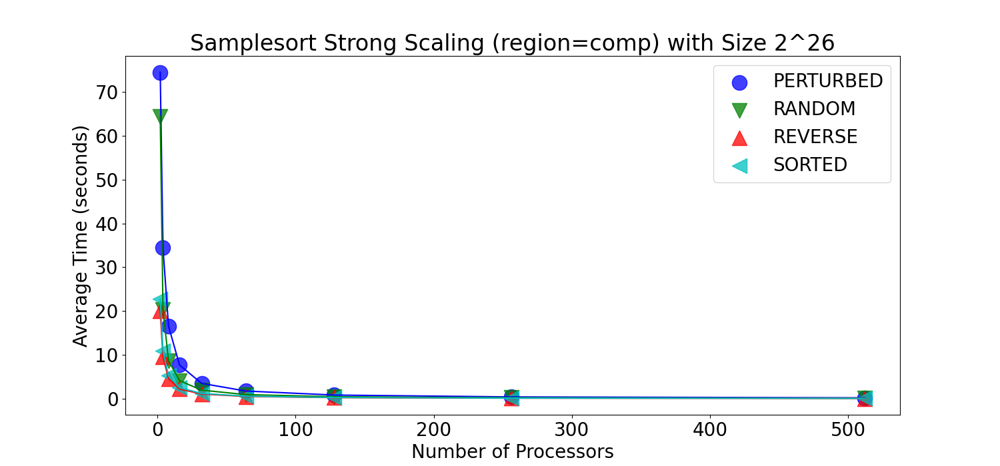
    - ##### Input Size 2^28:
      
      
      
  - #### Strong Scaling Speedup (Avg time/rank):
    The strong scaling speedup analysis for samplesort further confirms the observation using more processors does not necessarily lead to efficiency increases. The plots produced using the "main" region shows the speedup for small input size is low, while those for large input size is significantly higher. The plots produced using the "comm" region further highlights the communication overhead caused by using more processors. As shown in the "comm" region graphs, the speedup approaches 0 when the input size is small.
    - ##### Sorted:
      
      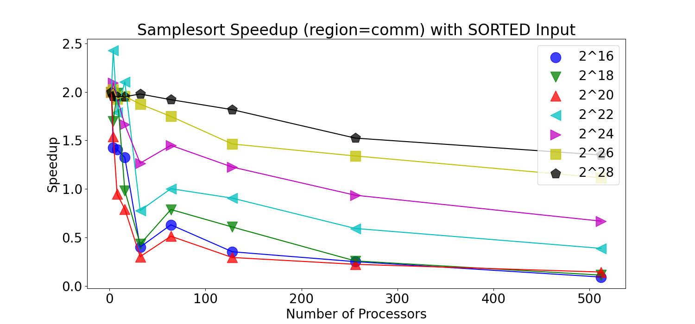
      
    - ##### Reverse:
      
      
      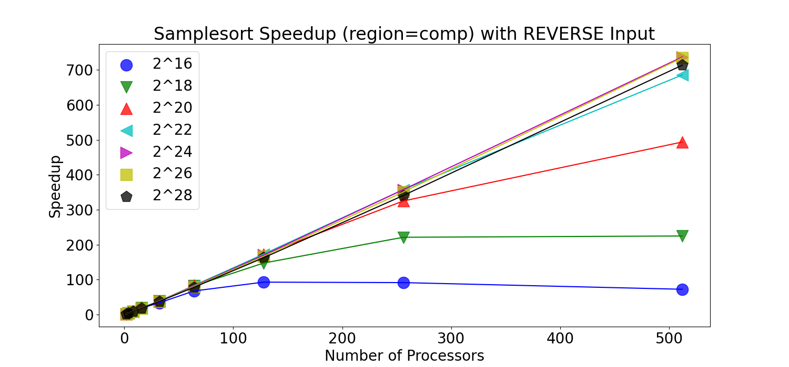
    - ##### Perturbed:
      
      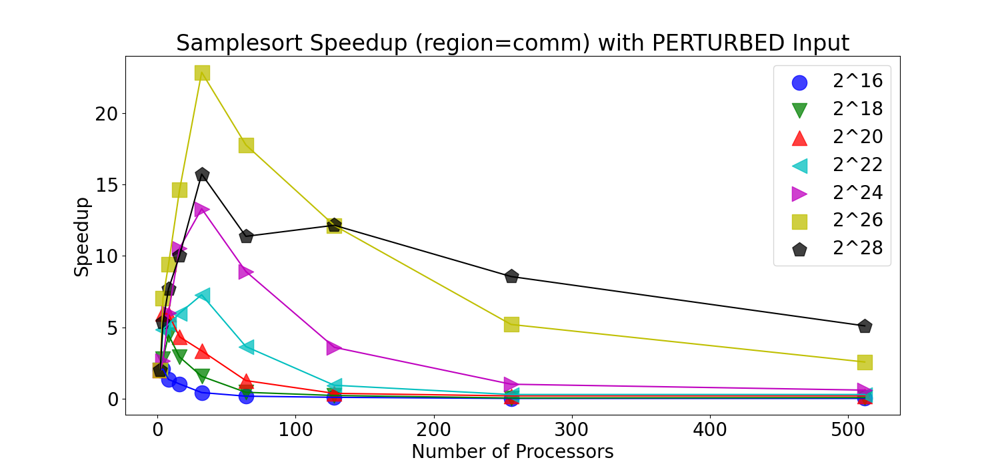
      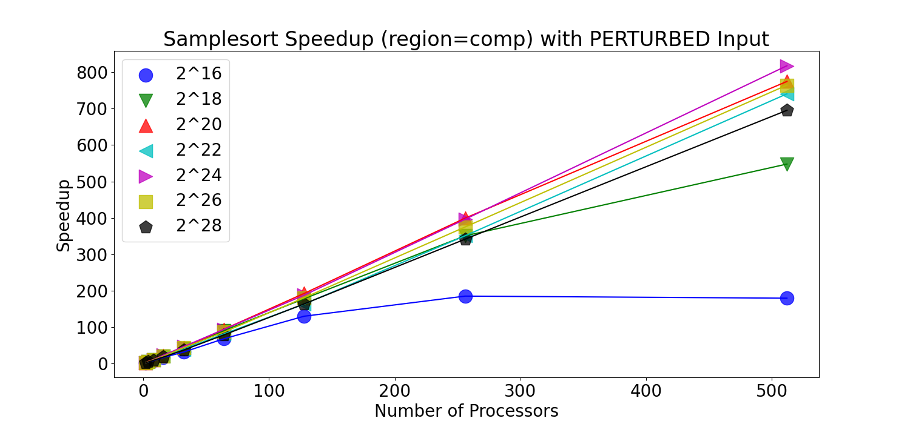
    - ##### Random:
      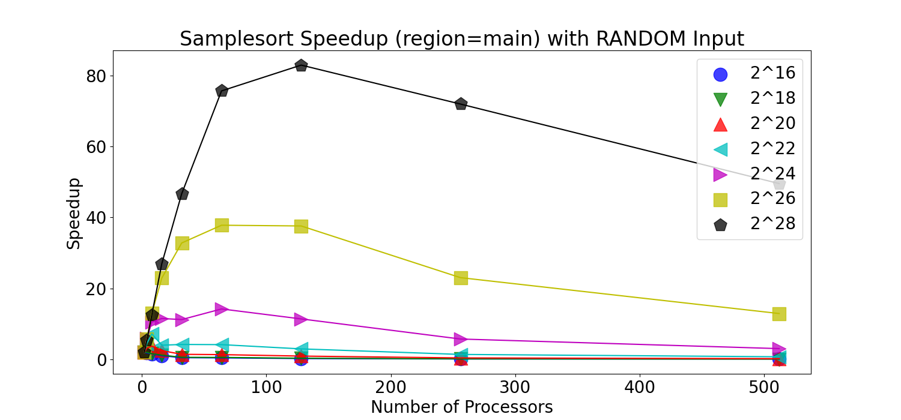
      
      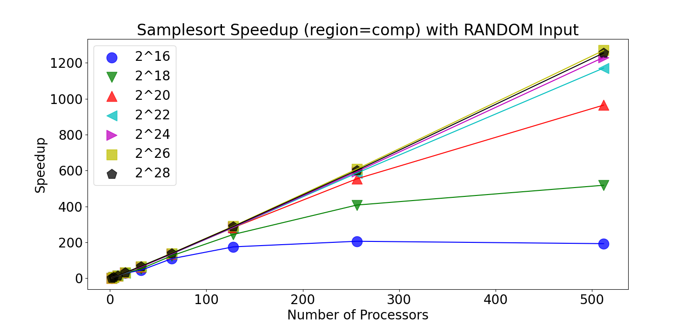
  - #### Weak Scaling (Avg time/rank):
    - ##### Sorted:
      
      
      
    - ##### Reverse:
      
      
      
    - ##### Perturbed:
      
      
      
    - ##### Random:
      
      
      
        
- ### Merge Sort ((Jack Couture))
 - #### Strong Scaling:
    As far as scaling goes, overall as the number of processors increased, the average time for regions and input configurations decreased intially. Hoever, this began to plateau around 128 to 256 processors or at times began to increase the average time. This is due to the overhead of managing the processors as well as merge sort beginning to see diminishing returns due to the merging of "buckets" leading to less and less opportunities to utilize parallel computing. Furthermore, perturbed seemed to overall exhibit higher processing times across most input sizes which most likely indicates this parallelization of merge sort is not well optimized for that input type. Finally, comp showed consistent improvement with increased processors and larger inputs indicating it benefitted from parallelization. The comm regiion showed less improvement and even showed an increase in time as processor count grew most likely indiciating the toll of communication overhead. The main region seemed to show improvement but began to plateu faster than camp with perturbed showing larger variance.
    - ##### Avg time/rank:
        
        
        
        
        
        
        
  - #### Strong Scaling Speedup
    For the comm region, the random and sorted input types peaked at low processor counts then struggled as the number of processors increased. Similar results can be seen with reverse input with a sharp initial speedup that quickly falls as communication overhead began to negatively impact performance. With perturbed there was a erratic speedup with large inputs with a lot of fluctuation. The irregular data pattern seems to reflect the larger communication and synchronization costs to work with perturbed. For the comp region, all input types had increasing speed up with processor count unlike comm. This is expected as the computation-focused region would see the most benefit from parallel processing and the reduction of workload. Finally, the main region had initial speedip but began to plateau or decrease at around 32 to 64 processors. At high input size the speedup remained steady with large processor counts. This indicates a balance between computation and communication overheads. 
    - ##### Main Region:
      
    - ##### Comp Region:
      
    - ##### Comm Region:
      
  - #### Weak Scaling
    For the main region, the average time generally increased for both input size and processor count. The increase was steady, especially with larger processor counts, indicting that the weak scaling is not ideal in the main region as it should be constant. For the comm region there was significant increase especially when you look at 128 and 512 processors. This shows the communication overhead becoming substantial as the number of processors and input size grows. This again indicates poor weak scaling. Finally, for the comp region, the average time remained almost constant across all processor counts and input sizes. This is ideal for weak scaling as it indicates the computational part of the merge sort algorithm scaled well with more data and processors.
    - ##### Main Region:
      
    - ##### Comp Region:
      
    - ##### Comm Region:
      
- ### Radix Sort (Deric Le)
  - #### Strong Scaling:
  - Comp region
    - For all input types, average time decreased as amount of processors increased
    - Total time taken for comp region increased as input size increased
    - this makes sense as more processors will decrease the workload per processor
  - Comm region
    - Average time taken is fairly stable as amount of processors increased
    - Total time taken for comm region increased as input size increased
  - Main region
    - For input types 2^16, 2^18, 2^20, 2^22, the average time increased as more processors were used. For input type 2^24, there is an initial decrease in time between 2 and 4 processors, and then the average time increases as the amount of processors increase. For smaller input sizes, increasing the amount of processors may decrease computational load on each processor, but increases the communication overhead. So for input 2^24, while there was an initial cut in time, the communication costs again start to increase after 4 processors, leading to an increase in average time.
    - ##### Avg time/rank:
    - 
    - 
    - 
    - 
    - 
    - 
    - 
  
  - #### Strong Scaling Speedup
  - Comp region
    - Graphs increase exponentially for larger input sizes as num of processors increase.
    - For smaller input sizes, there is less exponential growth; they are more linear.
    - this makes sense as more processors will decrease the workload/processor
  - Comm region
    - Graphs are spiky
    - for input size's 2^16, 2^18, 2^20, the speedup has a generally negative trend
    - for larger input sizes, speedup has a generally positive trend
  - Main region
    - as input size increases, speedup increases
    - as number of processors increase,
      - for large input: speedup increases
      - for small input: speedup slightly decreases
      - 

  - #### Weak Scaling
    From the weak scaling graphs, we can see that our implementation for bitonic sort is scalable and able to handle larger problem sizes without significant degradation in performance. For the main region, although the line is not perfectly flat and has an increase, looking at the y-axis, we can see that the increase is only about 1.5 seconds, which is not what we would consider as a significant increase. This slight increase is most likely due to the increased communication overhead from using more processors. We can kind of see that effect with the weak scaling graphs for the comm region, which shows that as the problem size got bigger and more processors were used, the average execution time slightly increased.
    - 
## 5. Presentation

Plots for the presentation should be as follows:

- For each implementation:
  - For each of comp_large, comm, and main:
    - Strong scaling plots for each input_size with lines for input_type (7 plots - 4 lines each)
    - Strong scaling speedup plot for each input_type (4 plots)
    - Weak scaling plots for each input_type (4 plots)

Analyze these plots and choose a subset to present and explain in your presentation.

Link to Presentation: https://docs.google.com/presentation/d/1DXX47mews-jL42tGsXIYynL6IjeSmpn-KnhKiRSiyMY/edit?usp=sharing


## 6. Final Report

Submit a zip named `TeamX.zip` where `X` is your team number. The zip should contain the following files:

- Algorithms: Directory of source code of your algorithms.
- Data: All `.cali` files used to generate the plots seperated by algorithm/implementation.
- Jupyter notebook: The Jupyter notebook(s) used to generate the plots for the report.
- Report.md
